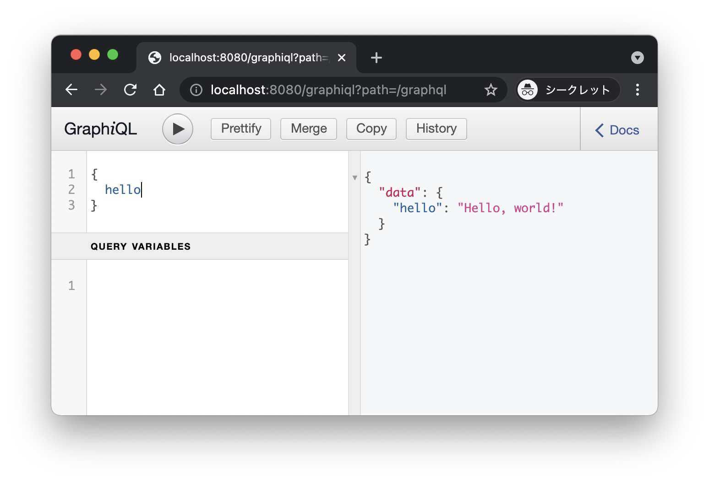

# spring-graphql-demo

## 動作確認

まずは起動する。

```
mvn spring-boot:run
```

`curl`(と`jq`)で動作確認してみる。

```
$ curl -s localhost:8080/graphql -XPOST -H "Content-Type: application/json" -d '{"query":"{hello}"}' | jq
{
  "data": {
    "hello": "Hello, world!"
  }
}
```

`spring.graphql.schema.printer.enabled=true`を設定していると http://localhost:8080/graphql/schema でスキーマを確認できる。

`spring.graphql.graphiql.enabled=true`を設定していると http://localhost:8080/graphiql でクエリエディター(GraphiQL)を使える。



## コードに関するメモ

スキーマ定義ファイルは`src/main/resources/graphql/schema.graphqls`。
data fetchingの定義は`com.example.helloworld.HelloWorldDataWiring`で行っている。

Web MVCで使う場合は`org.springframework.graphql.boot.GraphQlWebMvcAutoConfiguration`で自動設定されるみたい。

プロパティは`org.springframework.graphql.boot.GraphQlProperties`を見れば把握できそう。

### graphql.schema.DataFetcher

`graphql.schema.DataFetcher`は`java.util.Optional`を返しても良いっぽい(`BookDataWiring`と`BookRepository`あたりを参照)。

`graphql.schema.DataFetchingEnvironment`から`getSource`で現在処理している`type`を取得したり`getArgument`でクエリーパラメーターを取得して子`type`を取得することができる。

### org.dataloader.DataLoader

子`type`を辿るとき愚直に実装をするとN + 1問題が発生する。
それを解消するため`org.dataloader.DataLoader`というクラスがある。

まず`org.dataloader.DataLoader`を準備する。
今回は`org.dataloader.BatchLoader`インターフェースを実装したクラスを作って`DataLoader.newDataLoader`ファクトリーメソッドで`DataLoader`を準備している。
実装例は`com.example.tweet.UserLoader`を参照すること。

それから実装した`DataLoader`を`org.dataloader.DataLoaderRegistry`に登録して、その`org.dataloader.DataLoaderRegistry`を`graphql.ExecutionInput`へセットする。
`graphql.ExecutionInput`へセットする方法はWeb MVCであれば`org.springframework.graphql.web.WebInterceptor`を用いる。
ドキュメントは[Web Interception](https://docs.spring.io/spring-graphql/docs/current-SNAPSHOT/reference/html/#web-interception)のセクションを参照すること。
実装例は`com.example.tweet.TweetWebInterceptor`を参照すること。

最後にdata fetchingの定義で`DataFetchingEnvironment.getDataLoader`を使って`DataLoader`を取得して、`load`メソッドを呼び出す。
実装例は`com.example.tweet.TweetDataWiring`を参照すること。

ちなみに`load`メソッドの戻り値は`java.util.concurrent.CompletableFuture`となっている。
つまり`graphql.schema.DataFetcher`はシンプルな値の他に`java.util.Optional`や`java.util.concurrent.CompletableFuture`が返せるということになる。

## 参考リソース

- https://github.com/spring-projects/spring-graphql
- https://spring.io/blog/2021/07/06/hello-spring-graphql

